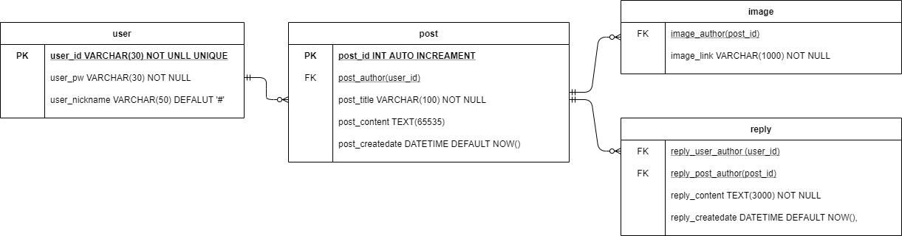

# crewSNS-back
### Node.js/Express/Prisma/MySQL/AWS EC2/AWS S3 를 사용한 SNS서비스 :: [백앤드]
---
## 2021.01.12
### crewSNS DB설계 작업
- ERD 설계 이미지

위에 이미지에 보여지는 것처럼 ERD를 만들어 보았다. 해당 ERD를 만들면서도 이렇게 연결을 하는 것이 맞는지, 해당키를 
기본키, 외래키로 설정해도 되는지 많은 고민을 하였다. 결과적으로는 구글 검색을 하며 내가 아는 지식을 동원하여 설계를 해보았고 실제 생성과 데이터 값 입력은 문제가 없어 해당 ERD구조로 진행할 것이며, 문제가 발생할 경우 바로 수정할 예정이다.

## 2021.01.13
### DB수정, Prisma ORM 테스트 연결
- Prisma를 설계한 DB와 연결을 해보았는데 오류가 발생하여 확인해보니 `image`테이블과 `reply`테이블 기본값이 없다고 오류가 발생되었다. 그래서 `image reply`테이블에 기본키를 추가하였다. 또한 
- 다음 작업으로는 Prisma와 MySQL를 연결하는 작업을 하였고 몇 가지 명령어들을 통해서 쉽게 연결할 수 있었다.
> `npm install @prisma/cli --save-dev`\
> `npx prisma`\
> `npx prisma init`\
> `npx prisma introspect`\
> `npm install @prisma/client`\
> `npx prisma generate`